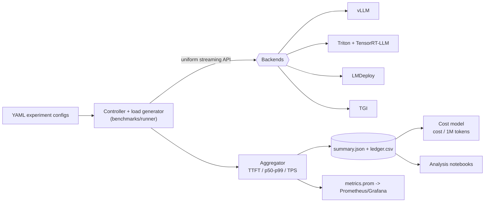

# trt-triton-llm-bench

**LLM Inference Optimization & Cost Benchmarking Suite** — an apples-to-apples
benchmark and optimization platform for production LLM serving:
**TensorRT-LLM + Triton vs vLLM vs LMDeploy/TurboMind vs TGI**, measuring TTFT,
inter-token latency, p50–p99, throughput (TPS/RPS), GPU/VRAM utilization, and
**cost per million tokens**.

> The authoritative product & architecture spec lives in [`blueprint.md`](./blueprint.md).
> This repository implements that blueprint incrementally; see **Status** below.

---

## Why this project exists

Production LLM inference has converged on a few ideas — continuous / in-flight
batching, paged KV cache, hardware-specific kernels, and OpenAI-compatible APIs
in front of optimized engines. Each runtime makes different trade-offs around
latency, portability, and operational ergonomics. This suite makes those
trade-offs **measurable and comparable on the same hardware and workloads**, and
ties infra-level tuning to a business metric: **cost per million tokens**.

> New here for hiring? See [`docs/portfolio.md`](./docs/portfolio.md) for a
> 60-second tour of what this demonstrates and which files to open first.

## Architecture at a glance



## Repository layout

```text
trt-triton-llm-bench/
  blueprint.md                 # Authoritative spec (source of truth)
  docs/                        # Architecture, experiments, cost model, comparisons
  infra/                       # docker-compose + k8s + Prometheus/Grafana
  models/
    convert/                   # HF -> TensorRT-LLM / ONNX + quantization wrappers
    triton_model_repo/         # Triton model repository (config.pbtxt templates)
  benchmarks/
    configs/                   # Config-driven experiments (YAML)
    runner/                    # Load generator, metrics collector, aggregator
  cost/                        # GPU pricing + cost-per-token analysis
  notebooks/analysis/          # Latency-vs-throughput, cost-per-token notebooks
  scripts/                     # launch_all.sh, run_experiment.sh
  tests/                       # Unit tests for the pure-Python core
```

## Quickstart: First Benchmark in 5 Steps

The harness ships with a **`mock` backend** that simulates TTFT and inter-token
latency, so you can exercise the full controller → metrics → aggregation → cost
pipeline on any machine (no GPU required).

```bash
# 1. Install runtime deps (Python 3.10+)
pip install -r requirements.txt

# 2. Run a benchmark (mock backend; writes results/<name>/summary.json + metrics.prom)
python -m benchmarks.runner.client \
    --config benchmarks/configs/single_gpu_baseline.yaml --backend mock --out results/

# 3. Estimate cost across providers for that run
python -m cost.cost_analysis --results results/single_gpu_baseline/summary.json --gpu-type A100_80GB

# 4. Compare "backends" head-to-head (mock here; real backends drop --backend)
python -m benchmarks.runner.run_comparison \
    --config benchmarks/configs/backend_comparison.yaml --backend mock --num-requests 8

# 5. Plot it: open notebooks/analysis/ after `pip install -e ".[analysis]"`
```

To benchmark a **real** backend, start one (see `infra/docker-compose.yml`) and
point a config at it (`backend.type: vllm|tgi|triton|lmdeploy`,
`backend.base_url: ...`), then re-run without `--backend mock`.

## Documentation

| Doc | Contents |
|-----|----------|
| [`docs/architecture.md`](./docs/architecture.md) | Components, request/benchmark flow, Mermaid diagrams, monitoring |
| [`docs/experiments.md`](./docs/experiments.md) | Config schema, smoke tests, experiment catalog, methodology |
| [`docs/quantization.md`](./docs/quantization.md) | FP8/INT8/INT4 paths and the speed/cost/accuracy trade-off |
| [`docs/cost-model.md`](./docs/cost-model.md) | Cost-per-million-tokens formula, pricing table, CLI |
| [`docs/comparisons.md`](./docs/comparisons.md) | Backend matrix + the comparison helper |
| [`docs/portfolio.md`](./docs/portfolio.md) | What this project demonstrates (for reviewers) |

## Status (implemented vs. conceptual)

| Area | Status | Notes |
|------|--------|-------|
| Benchmark harness (controller, load gen, metrics, aggregation) | **Implemented** | Pure Python; runnable via the `mock` backend with no GPU |
| Backend clients: vLLM / TGI (OpenAI-compatible), Triton generate | **Implemented (needs a live server)** | OpenAI-style streaming + Triton `generate_stream` |
| Cost model (cost/M tokens, cost/request) | **Implemented** | Driven by `cost/gpu_pricing.yaml` |
| GPU metrics collection | **Implemented (best-effort)** | Samples `nvidia-smi`; degrades gracefully if absent |
| Model conversion (TRT-LLM / ONNX) + quantization | **CLI wrappers / plans** | Require a GPU + TensorRT-LLM toolchain |
| Triton model repo `config.pbtxt` | **Template** | Must match the built engine |
| `infra/` docker-compose + k8s + Prometheus/Grafana | **Templates** | Not validated locally (no Docker here); pin versions before use |
| Cross-backend comparison helper | **Implemented** | `run_comparison.py` → `comparison.md`/`.csv` |
| Benchmark metrics export (Prometheus textfile) | **Implemented** | `metrics.prom` per run for the textfile collector |
| Notebooks (latency/TPS, cost/token) | **Starter** | Read aggregated results |

## Development

```bash
pip install -e ".[dev]"   # ruff + pytest
make lint                 # ruff check
make format               # ruff format
make test                 # pytest
```

(Windows / no-make users can run the underlying commands directly — see the `Makefile`.)

## License

Not yet specified. Add a `LICENSE` before publishing.
