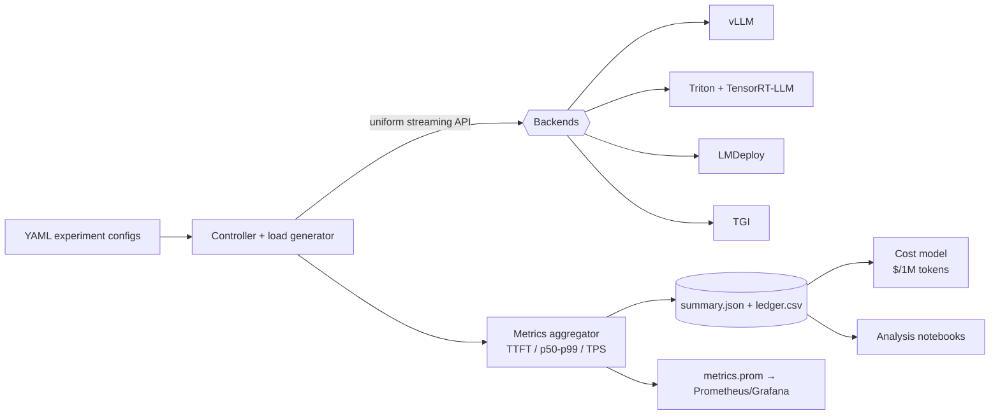

# Production-Grade Triton + TensorRT-LLM Benchmark & Inference Optimization Suite

**Cross-runtime LLM serving benchmarks with cost per million tokens — not just tokens/sec.**

Most teams pick a serving stack by default. This suite runs the **same workload** through TensorRT-LLM + Triton, vLLM, LMDeploy/TurboMind, and TGI on identical hardware, then ties throughput and latency to **$/million tokens** across GPU providers.

The questions it is built to answer:

- At a given concurrency, which runtime gives the best p95 latency for the cost?
- Where does FP8 on H100 actually pay off vs FP16 on A100?
- How do Triton's dynamic batcher and TRT-LLM's in-flight batcher interact — and what should `max_queue_delay_microseconds` be?

Everything is **config-driven, reproducible, and instrumented** — warm-up phases, closed-loop load, percentile latencies, Prometheus export, cross-backend comparison tables.

[](https://www.python.org/downloads/)
[](./tests/)
[](./docs/comparisons.md)

---

## Scope

| Area | Implementation |
|------|----------------|
| **Multi-backend harness** — one controller, uniform streaming API | [`benchmarks/runner/backends.py`](./benchmarks/runner/backends.py) |
| **Benchmark methodology** — TTFT, ITL, p50/p95/p99, TPS/RPS, closed-loop concurrency | [`benchmarks/runner/result_aggregator.py`](./benchmarks/runner/result_aggregator.py) |
| **Two-level batching** — Triton dynamic batching × TRT-LLM in-flight batching | [`models/triton_model_repo/llama3-8b-trt/config.pbtxt`](./models/triton_model_repo/llama3-8b-trt/config.pbtxt) |
| **Quantization matrix** — FP16 / FP8 / INT8 / INT4, mapped to the backend that serves each | [`docs/quantization.md`](./docs/quantization.md) |
| **Observability** — DCGM, Prometheus, Grafana, per-run `metrics.prom` | [`infra/docker-compose.yml`](./infra/docker-compose.yml) |
| **Cost model** — GPU/hr → $/million tokens, $/request, multi-provider | [`cost/cost_analysis.py`](./cost/cost_analysis.py) |
| **Architecture spec** — 830-line design doc covering MVA → enterprise tiers | [`blueprint.md`](./blueprint.md) |

---

## Architecture



Single-node, K8s, and request-flow diagrams: [`docs/architecture.md`](./docs/architecture.md)

---

## Quickstart

No GPU required — the `mock` backend simulates TTFT and inter-token latency so the full pipeline runs locally:

```bash
pip install -r requirements.txt

python -m benchmarks.runner.client \
    --config benchmarks/configs/single_gpu_baseline.yaml --backend mock --out results/

python -m cost.cost_analysis \
    --results results/single_gpu_baseline/summary.json --gpu-type A100_80GB

python -m benchmarks.runner.run_comparison \
    --config benchmarks/configs/backend_comparison.yaml --backend mock --num-requests 8
```

On a GPU host: `docker compose -f infra/docker-compose.yml --profile vllm up -d`, point a config at the endpoint, drop `--backend mock`.

---

## Tech stack

| Layer | Technologies |
|-------|--------------|
| **Serving runtimes** | TensorRT-LLM, Triton Inference Server, vLLM, LMDeploy/TurboMind, Hugging Face TGI |
| **GPU targets** | A100 80GB, H100 80GB, L40S 48GB |
| **Quantization** | FP16, FP8 (Hopper TE), INT8 SmoothQuant, INT4 AWQ/GPTQ |
| **Observability** | DCGM exporter, Prometheus, Grafana, `nvidia-smi` |
| **Orchestration** | Docker Compose profiles, Kubernetes deployment templates |
| **Harness** | Python 3.10+, async httpx, YAML sweeps, pytest + ruff |

---

## Experiment matrix

| Config | Axis under test |
|--------|-----------------|
| [`single_gpu_baseline.yaml`](./benchmarks/configs/single_gpu_baseline.yaml) | Reference point — fixed concurrency, FP16 |
| [`concurrency_sweep.yaml`](./benchmarks/configs/concurrency_sweep.yaml) | TTFT / p95 / TPS vs in-flight requests |
| [`multi_precision_sweep.yaml`](./benchmarks/configs/multi_precision_sweep.yaml) | FP16 → FP8 → INT8 → 4-bit |
| [`backend_comparison.yaml`](./benchmarks/configs/backend_comparison.yaml) | Runtime head-to-head, same workload |

Methodology and config schema: [`docs/experiments.md`](./docs/experiments.md)

---

## Layout

```text
├── blueprint.md              # Architecture spec
├── benchmarks/runner/        # Controller, backends, metrics, aggregation
├── benchmarks/configs/       # Experiment YAML
├── cost/                     # GPU pricing + cost-per-token engine
├── models/convert/           # TRT-LLM / ONNX / quantization wrappers
├── models/triton_model_repo/ # Triton config.pbtxt
├── infra/                    # docker-compose + k8s + Prometheus/Grafana
├── docs/                     # Architecture, experiments, cost model, comparisons
├── notebooks/analysis/       # Latency-vs-TPS, cost-per-token
└── tests/
```

---

## Docs

| | |
|---|---|
| [`docs/architecture.md`](./docs/architecture.md) | Components, data flows, monitoring |
| [`docs/experiments.md`](./docs/experiments.md) | Config schema, smoke tests, interpretation |
| [`docs/comparisons.md`](./docs/comparisons.md) | Backend matrix, comparison helper |
| [`docs/cost-model.md`](./docs/cost-model.md) | Formulas, pricing, CLI |
| [`docs/quantization.md`](./docs/quantization.md) | Precision paths per backend |
| [`blueprint.md`](./blueprint.md) | Full product & architecture blueprint |

---

## Development

```bash
pip install -e ".[dev]"
make test    # 11 passing
make lint
```

---

## Status

| Component | |
|-----------|---|
| Config-driven harness + mock backend | ✅ |
| vLLM / TGI / Triton / LMDeploy clients | ✅ (live server required) |
| Metrics aggregation + Prometheus export | ✅ |
| Cross-backend comparison | ✅ |
| Cost model | ✅ |
| docker-compose + k8s + Grafana | 📋 templates — pin images before deploy |
| TRT-LLM build + quantization | 📋 CLI wrappers — `--run` on GPU host |
