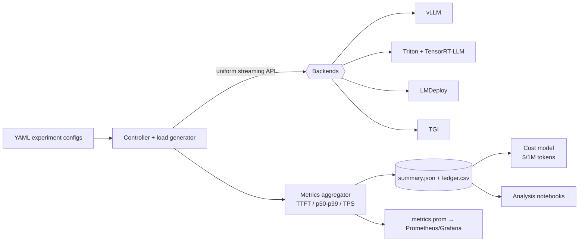

# Production-Grade Triton + TensorRT-LLM Benchmark & Inference Optimization Suite

**Apples-to-apples LLM serving benchmarks across NVIDIA's fastest stack and the open-source alternatives — with cost per million tokens, not just tokens/sec.**

> *"Which backend should we run in production — TensorRT-LLM, vLLM, LMDeploy, or TGI? At what concurrency? What does FP8 actually buy us on H100? What does it cost per million tokens on RunPod vs AWS?"*
>
> This repo answers those questions with **reproducible, config-driven experiments** — the kind of infra R&D platform teams build internally, open-sourced as a portfolio artifact.

[](https://www.python.org/downloads/)
[](./tests/)
[](./docs/comparisons.md)

---

## Why recruiters & hiring managers should care

Most LLM repos show *one* serving stack. This one shows you understand **the full inference landscape** — compiled NVIDIA engines vs flexible runtimes, latency vs throughput trade-offs, quantization, observability, and **FinOps for ML** (GPU/hr → cost/token).

| What this demonstrates | Where to see it |
|------------------------|-----------------|
| **Multi-backend serving** — Triton + TensorRT-LLM, vLLM, LMDeploy/TurboMind, TGI behind one uniform harness | [`benchmarks/runner/backends.py`](./benchmarks/runner/backends.py) |
| **Production benchmarking** — TTFT, ITL, p50/p95/p99, TPS/RPS, closed-loop concurrency (GenAI-Perf / LLMPerf aligned) | [`benchmarks/runner/result_aggregator.py`](./benchmarks/runner/result_aggregator.py) |
| **Scheduler tuning** — Triton dynamic batching × TRT-LLM in-flight batching (two-level batching) | [`models/triton_model_repo/llama3-8b-trt/config.pbtxt`](./models/triton_model_repo/llama3-8b-trt/config.pbtxt) |
| **Quantization paths** — FP16 / FP8 / INT8 SmoothQuant / INT4 AWQ with per-backend artifact mapping | [`docs/quantization.md`](./docs/quantization.md) |
| **Observability** — DCGM + Prometheus + Grafana + per-run `metrics.prom` export | [`infra/docker-compose.yml`](./infra/docker-compose.yml) |
| **Cost modeling** — GPU marketplace pricing → **$/million tokens** and **$/request** | [`cost/cost_analysis.py`](./cost/cost_analysis.py) |
| **Systems design** — docker-compose + K8s manifests, config-driven experiment matrix, cross-backend comparison reports | [`blueprint.md`](./blueprint.md) |

**Resume bullets this project backs up:**

- Designed and implemented a **multi-backend LLM inference benchmarking suite** comparing TensorRT-LLM/Triton, vLLM, LMDeploy, and TGI, measuring TTFT, p50–p99 latency, tokens/sec, and cost per million tokens.
- Built **GPU-optimized TensorRT-LLM deployment scaffolding** with Triton dynamic batching, in-flight batching, and paged KV cache configuration.
- Developed a **configuration-driven experiment harness** with YAML sweeps, Prometheus metrics export, and automated cross-backend comparison tables.
- Quantified **cloud cost trade-offs** across GPU marketplace providers by combining GPU/hr pricing with runtime throughput metrics.

---

## Architecture at a glance



Full diagrams (single-node, K8s, request flow): [`docs/architecture.md`](./docs/architecture.md)

---

## Try it in 60 seconds — no GPU required

The harness includes a **`mock` backend** that simulates TTFT and inter-token latency, so reviewers can run the full pipeline on any laptop:

```bash
pip install -r requirements.txt

# Run a benchmark → writes summary.json + Prometheus metrics
python -m benchmarks.runner.client \
    --config benchmarks/configs/single_gpu_baseline.yaml --backend mock --out results/

# Cost across GPU providers (RunPod, Lambda, Vast, AWS…)
python -m cost.cost_analysis --results results/single_gpu_baseline/summary.json --gpu-type A100_80GB

# Head-to-head backend comparison table (Markdown + CSV)
python -m benchmarks.runner.run_comparison \
    --config benchmarks/configs/backend_comparison.yaml --backend mock --num-requests 8
```

On a GPU host: `docker compose -f infra/docker-compose.yml --profile vllm up -d`, point a config at the endpoint, drop `--backend mock`.

---

## Tech stack

| Layer | Technologies |
|-------|--------------|
| **Serving runtimes** | NVIDIA TensorRT-LLM, Triton Inference Server, vLLM, LMDeploy/TurboMind, Hugging Face TGI |
| **GPU targets** | A100 80GB, H100 80GB, L40S 48GB (configurable) |
| **Quantization** | FP16, FP8 (Hopper TE), INT8 SmoothQuant, INT4 AWQ/GPTQ |
| **Observability** | DCGM exporter, Prometheus, Grafana, `nvidia-smi` sampling |
| **Orchestration** | Docker Compose profiles, Kubernetes deployment templates |
| **Harness** | Python 3.10+, async HTTP (httpx), YAML config sweeps, pytest + ruff |

---

## Key experiments (config-driven)

| Config | What it answers |
|--------|-----------------|
| [`single_gpu_baseline.yaml`](./benchmarks/configs/single_gpu_baseline.yaml) | Reference latency/throughput at fixed concurrency |
| [`concurrency_sweep.yaml`](./benchmarks/configs/concurrency_sweep.yaml) | How TTFT & p95 scale as in-flight requests grow |
| [`multi_precision_sweep.yaml`](./benchmarks/configs/multi_precision_sweep.yaml) | FP16 vs FP8 vs INT8 vs 4-bit speed/cost trade-offs |
| [`backend_comparison.yaml`](./benchmarks/configs/backend_comparison.yaml) | Which runtime wins for this model + workload |

Details: [`docs/experiments.md`](./docs/experiments.md)

---

## Repository layout

```text
├── blueprint.md              # Full architecture spec (830-line design doc)
├── benchmarks/runner/        # Controller, backends, metrics, aggregation, comparison
├── benchmarks/configs/       # YAML experiment matrix
├── cost/                     # GPU pricing table + cost-per-token engine
├── models/convert/           # TRT-LLM / ONNX / quantization CLI wrappers
├── models/triton_model_repo/ # Triton config.pbtxt (dynamic + in-flight batching)
├── infra/                    # docker-compose + k8s + Prometheus/Grafana
├── docs/                     # Architecture, experiments, cost model, comparisons
├── notebooks/analysis/       # Latency-vs-TPS, cost-per-token plots
└── tests/                    # Unit tests (11 passing)
```

---

## Documentation

| Doc | For reviewers who want to understand… |
|-----|--------------------------------------|
| [`docs/portfolio.md`](./docs/portfolio.md) | **Start here** — 60-second tour + which 5 files to open |
| [`docs/architecture.md`](./docs/architecture.md) | Components, data flows, monitoring strategy |
| [`docs/experiments.md`](./docs/experiments.md) | Config schema, smoke tests, how to interpret results |
| [`docs/comparisons.md`](./docs/comparisons.md) | Backend matrix + running cross-runtime comparisons |
| [`docs/cost-model.md`](./docs/cost-model.md) | Cost formulas, pricing assumptions, CLI usage |
| [`docs/quantization.md`](./docs/quantization.md) | Which backend serves which precision |
| [`blueprint.md`](./blueprint.md) | The full product & architecture blueprint |

---

## Development

```bash
pip install -e ".[dev]"    # ruff + pytest
make test                  # 11 tests
make lint                  # ruff check
```

---

## Status

| Component | Status |
|-----------|--------|
| Config-driven benchmark harness + mock backend | ✅ Runnable today |
| vLLM / TGI / Triton / LMDeploy clients | ✅ Implemented (needs live server) |
| Metrics aggregation + Prometheus textfile export | ✅ Implemented |
| Cross-backend comparison helper | ✅ Implemented |
| Cost model (multi-provider GPU pricing) | ✅ Implemented |
| docker-compose + k8s + Grafana templates | 📋 Ready to deploy (pin image versions) |
| TRT-LLM engine build + quantization | 📋 CLI wrappers (`--run` on GPU host) |

---

## Author

Built as a **principal-level AI infrastructure portfolio project** — demonstrating the depth expected for LLM serving, GPU optimization, and ML platform engineering roles.

Questions or feedback? Open an issue or reach out via GitHub.
