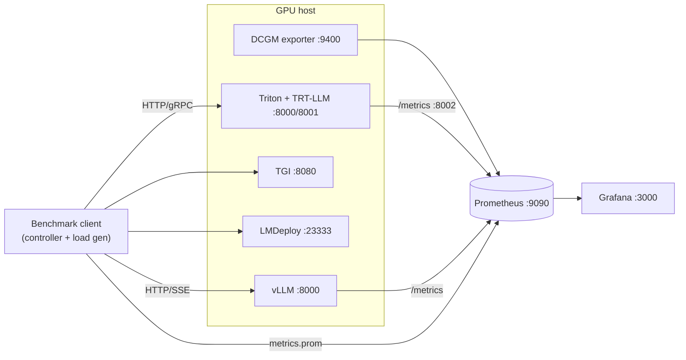
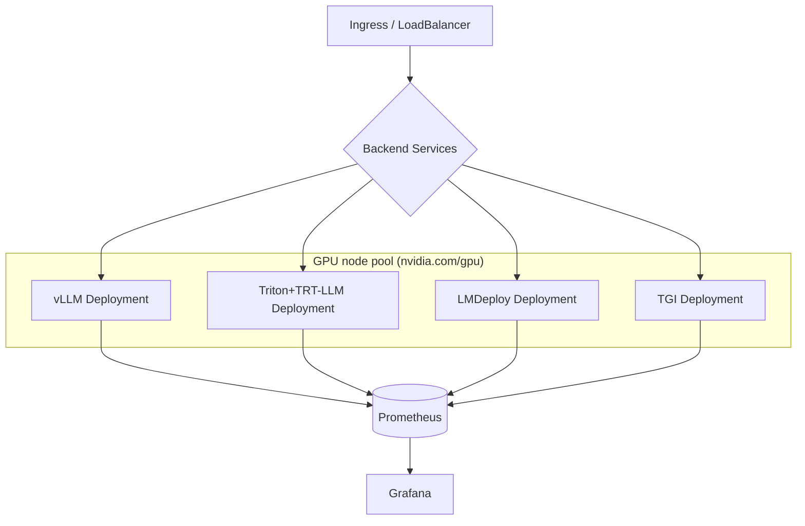
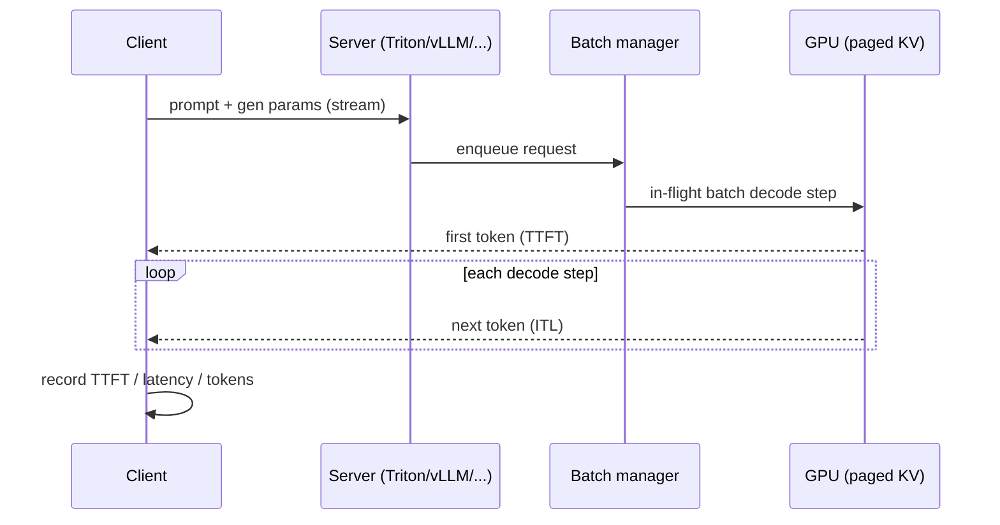

# Architecture

This document maps the [`blueprint.md`](../blueprint.md) architecture onto what
is implemented in this repository. See the blueprint for the full four-tier
design (MVA → Professional → Production-Grade → Enterprise); below is the
concrete component view and how it lands in code.

## Components

| Blueprint component | Implementation | Location |
|---------------------|----------------|----------|
| Experiment Controller (EC) | Config-driven async controller | `benchmarks/runner/client.py` |
| Benchmark Client(s) | Closed-loop load generator (workers) | `benchmarks/runner/client.py` |
| Serving Backends | vLLM / TGI / Triton clients + mock | `benchmarks/runner/backends.py` |
| Metrics & Logging | `nvidia-smi` sampler (+ Prometheus plan) | `benchmarks/runner/metrics_collector.py` |
| Result Aggregator | Percentiles, TPS/RPS, TTFT/ITL, CSV/JSON | `benchmarks/runner/result_aggregator.py` |
| Cost Modeling Engine | cost/M tokens, cost/request | `cost/cost_analysis.py`, `cost/gpu_pricing.yaml` |
| Model Conversion | TRT-LLM / ONNX / quantization wrappers | `models/convert/*.py` |
| Serving infra | docker-compose + k8s + Prometheus/Grafana | `infra/` |

## Inference request flow (Triton + TensorRT-LLM)

1. Client sends an HTTP/gRPC request (prompt + generation params) to Triton.
2. Triton's front-end enqueues it in the per-model scheduler.
3. The **dynamic batcher** aggregates requests up to `max_batch_size` within
   `max_queue_delay_microseconds`.
4. Batches dispatch to the **TensorRT-LLM backend**, whose **Batch Manager**
   performs **in-flight (continuous) batching**.
5. TensorRT-LLM maps requests into a continuous batch, manages **paged KV cache**
   blocks, and runs the decode loop.
6. Tokens stream back through Triton to the client.

> **Two levels of batching.** Triton's *request-level* dynamic batching sits in
> front of TensorRT-LLM's *iteration-level* in-flight batching. These must be
> tuned together (see `models/triton_model_repo/llama3-8b-trt/config.pbtxt`) to
> keep GPUs saturated without inflating TTFT via double queuing.

## Benchmark flow

1. The controller loads an experiment (or sweep) config (`benchmarks/configs/`).
2. It warms up, then drives `concurrency` requests in flight (closed loop).
3. Each request records submit time, first-token time (TTFT), completion time,
   and token counts → `RequestResult`.
4. A background sampler scrapes `nvidia-smi` for GPU utilization / VRAM / power.
5. The aggregator merges per-request data + GPU metrics into a `summary.json`
   and appends a row to `results/summary_ledger.csv`.
6. The cost engine converts the summary + GPU price into cost/M tokens.

## Concurrency model

The load generator is **closed-loop**: exactly `concurrency` workers each keep a
single request in flight, so the offered concurrency equals the configured
value. This matches how LLM serving "concurrency" is typically reported and
avoids the open-loop pitfall of unbounded queue growth masking backend latency.

## Monitoring strategy (current vs. planned)

- **Implemented:** per-run GPU sampling via `nvidia-smi` (graceful no-op when
  absent), embedded into each `summary.json` under `gpu`.
- **Planned (templated in `infra/`):** DCGM-exporter → Prometheus → Grafana, plus
  scraping backend-native metrics endpoints (Triton `:8002/metrics`, vLLM/TGI
  `/metrics`). A `PrometheusScraper` can be added alongside `GpuSampler` behind
  the same summary interface.

## Deviations from the blueprint

- A `tests/` directory (pure-Python unit tests) was added for the harness/cost
  core; the blueprint folder layout did not enumerate it. This is an additive,
  non-conflicting change that supports the code-quality directive.
- The repo root spec file was renamed to `blueprint.md` to satisfy the
  "authoritative `blueprint.md`" requirement (content unchanged).

## Triton + TensorRT-LLM Backend (FP16)

The Triton path serves a compiled TensorRT-LLM engine. Text in / text out flows
through the standard `tensorrtllm_backend` **ensemble** (preprocessing →
`tensorrt_llm` → postprocessing); the benchmark client targets that ensemble's
`/v2/models/<ensemble>/generate_stream` endpoint (`backend.type: triton` /
alias `triton_trtllm`, `api_style: triton-generate`).

Request flow: **client → Triton HTTP/gRPC → dynamic batcher → TRT-LLM Batch
Manager (in-flight batching) → paged-KV decode loop → streamed tokens → client.**
The core engine model (`models/triton_model_repo/llama3-8b-trt/config.pbtxt`)
runs on a **`KIND_CPU` instance group** — this is intentional: the
`tensorrtllm` backend uses a CPU-side instance to drive the GPU engine and its
own continuous batching, so adding GPU instances there is usually unnecessary;
scale concurrency via the engine's `max_batch_size` and KV-cache fraction
instead. The two batching levels (Triton dynamic batching + TRT-LLM in-flight
batching) are tuned together (small `max_queue_delay_microseconds`).

## Diagrams

### Single-node (docker-compose)



### Kubernetes (logical)



### Inference data flow



## Monitoring smoke test

Each benchmark run also writes a Prometheus text-exposition file
(`results/<name>/metrics.prom`) via `result_aggregator.write_prometheus_textfile`
— point a node_exporter *textfile collector* (or a Pushgateway) at it to land
benchmark KPIs (`llm_bench_output_tps`, `llm_bench_latency_seconds_p95`, …) next
to GPU/runtime metrics.

```bash
# 1. Bring up a backend + the monitoring stack
docker compose -f infra/docker-compose.yml --profile vllm --profile monitoring up -d

# 2. Run a small benchmark
python -m benchmarks.runner.client --config benchmarks/configs/smoke_vllm.yaml

# 3. Verify scraping
#    - Prometheus targets:  http://localhost:9090/targets   (dcgm/triton/vllm UP)
#    - Grafana:             http://localhost:3000           (dashboard "LLM Inference Overview")
```
